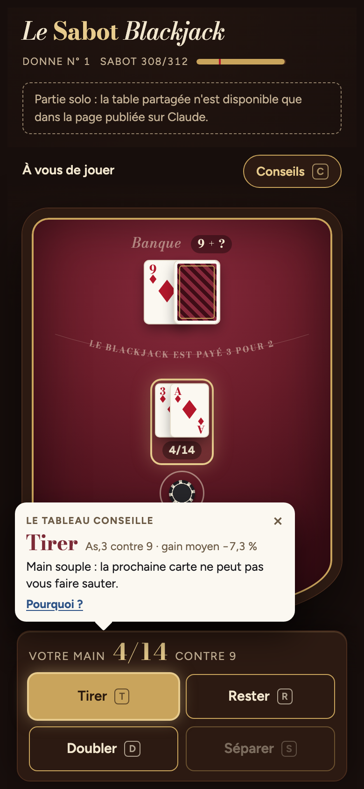

# Le Sabot Blackjack

Table de blackjack multijoueur en temps réel : jusqu'à cinq joueurs contre la banque, sur un tapis bordeaux.



## Jouer

- **Multijoueur** : la table partagée tourne comme artifact Claude (la page publiée sur claude.ai). Pour inviter des joueurs, partager l'artifact avec l'accès **Contributeur**. Avec un accès Lecteur, on regarde la partie sans s'asseoir.
- **Solo (web)** : `index.html` est un site statique, à déployer sur Vercel ou à ouvrir dans n'importe quel navigateur. On joue seul contre la banque, et les jetons sont gardés dans le navigateur (localStorage). Le multijoueur n'existe que dans la version artifact.

## Règles

- Sabot de 6 jeux, remélangé quand il reste moins d'un quart des cartes.
- Mise de 25 à 5 000. Chaque joueur commence avec 5 000 jetons, recave de 5 000 possible.
- La banque tire à 16 et reste sur tous les 17. Le blackjack est payé 3 pour 2.
- Doubler sur les deux premières cartes, y compris après une séparation.
- Séparer jusqu'à 4 mains. As séparés : une seule carte chacun.
- Pas d'assurance ni d'abandon.

## Fonctionnalités

- **Synchronisation en direct** de la table entre tous les joueurs, avec un verrou court pour qu'une seule action s'applique à la fois.
- **Conseiller** : tableau de stratégie de base (mains dures, souples, paires), explication du coup, probabilités calculées sur les cartes encore non vues (risque de sauter, banque qui saute, gain moyen de chaque choix) et compte Hi-Lo avant la donne.
- **Bulle « meilleur coup »** à chaque tour, calée au-dessus des boutons et pointée vers le coup conseillé.
- **Absents** : 30 s pour jouer son tour (sinon la main s'arrête et la place se libère après la donne), retrait de la table après 2 min sans action, bouton « Je reste ».
- **Mobile** : grands boutons en 2×2, conseiller en panneau coulissant, barre d'état fixe.
- **Effets** : ampoules de casino qui clignotent sur le rebord du tapis, projecteur sur la main jouée, faisceaux de lumière, confettis et jetons qui volent, secousses et zooms de caméra, gros textes animés (« BLACKJACK ! », « SAUTÉ ! », « LA BANQUE SAUTE ! », « 21 ! »), compteur de jetons qui défile, série de victoires, sons générés à la volée (Web Audio, aucun fichier) et vibrations sur téléphone. Les effets suivent l'état partagé : chaque joueur voit aussi les moments des autres.
- **Sur le tapis** : un sabot d'où partent les cartes (avec la carte rouge de coupe), un bac qui se remplit des cartes jouées, le rack de jetons de la banque. La banque paie les gagnants et ramasse les mises perdues en jetons volants. Elle vérifie sa carte cachée sous un 10 ou un As.
- **Joueurs** : couronne pour le meneur de la table, anneau-chrono de 30 s autour de la place qui joue.
- **Votre tour** : la caméra zoome sur votre main, qui respire, le reste de la table s'assombrit (vignettage, autres places désaturées). Quand la banque joue, la caméra passe sur ses cartes au rythme d'un battement de cœur.
- **Suspense** : les cartes que vous tirez arrivent face cachée puis se retournent. Un court temps de lecture (0,45 s) précède « SAUTÉ » ou « 21 », et la banque ne joue qu'après.
- **Force de la main** : une main à 19 ou 20 brille (lueur dorée, halo, reflet, étincelles) ; une main fragile (12 à 16) fait pulser son total en rouge pendant votre tour. Une bonne main battue par la banque déclenche une déception (« SI PRÈS… » ou « DOMMAGE… », cartes qui ternissent, petite pluie, trombone triste) ; une victoire avec une main faible donne « OUF ! ».
- **Éclats** : reflet doré sur une main à 21, reflet holographique sur un blackjack, poussière dorée qui flotte sur le tapis, jetons qui scintillent, bouton « Miser » qui appelle au clic.
- **Animations de victoire, à tour de rôle** :
  - *Drift* : une voiture vue de dessus entre sur le tapis, fait un donut en dérapage (traces de pneus sur le feutre, fumée, crissement) et repart.
  - *Couteau papillon* : les 5 premières secondes d'une vidéo sur fond vert (`knife.mp4`), détourée en direct dans le navigateur (shader WebGL, repli en canvas 2D), affichées en bas à droite comme dans un jeu de tir. Avec le son du clip si le son est activé.
- **Défausse** : bac en verre où les cartes jouées se retournent face cachée et s'empilent à chaque nouvelle donne.
- **Niveau** : chaque main rapporte de l'XP (plus pour une victoire, un double gagnant, un blackjack ou une série). L'anneau à côté du nom se remplit, avec une fête à chaque niveau. Gardé sur l'appareil.
- **Ambiance** : lumières de salle floues en fond, cartes qui suivent la souris sur ordinateur.
- **Réglages** (☰ → Réglages) : son, vibrations et effets visuels, gardés sur l'appareil. Les animations sont réduites si le système le demande.
- Journal de la table et classement des gains.

Raccourcis clavier pendant votre tour : **T** tirer, **R** rester, **D** doubler, **S** séparer. **C** ouvre les conseils, **M** coupe ou remet le son, **Entrée** valide la mise.

## Fichiers

| Fichier | Rôle |
| --- | --- |
| `sabot-blackjack.html` | Source de l'artifact Claude (sans `<html>`/`<head>`, ajoutés par la visionneuse). |
| `index.html` | Page autonome, générée par `./build.sh`. Ne pas modifier à la main. |
| `knife.mp4` | Clip de 5 s sur fond vert pour l'animation du couteau (détouré à l'affichage). |
| `build.sh` | Régénère `index.html` à partir du source (titre, favicon et balises de partage dans le `<head>`). |
| `vercel.json` | En-têtes de sécurité et URL propres pour Vercel. |
| `.vercelignore` | N'envoie que `index.html` en ligne (pas le source ni le script). |

Après une modification de `sabot-blackjack.html` :

```sh
./build.sh
```

## Déployer sur Vercel

Aucune étape de build : `index.html` est déjà généré et versionné.

1. Sur vercel.com, **Add New → Project**, puis importer le dépôt `SabotBJ`.
2. Framework Preset : **Other**. Laisser Build Command et Output Directory vides.
3. **Deploy**.

Chaque `git push` sur `main` redéploie le site. Pensez à lancer `./build.sh` avant de committer une modification du source.
